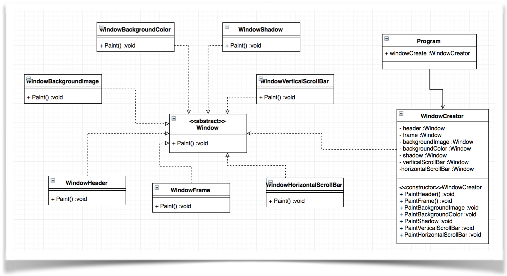

#Facade-Pattern

Geliştirdiğiniz bir yazılımda görsel kullanıcı arayüzünde çeşitli pencereler kullandığınızı varsayın. Bir pencere temel haliyle çerçevesiz, beyaz bir dikdörtgenden ibarettir. Kullanıcınızın tercihlerine bağlı olarak pencerelerin şu opsiyonel görsel özellikleri istenilen kombinasyonda sunabilmesi gerektiğini düşünün:

- Pencerenin başlığı olabilir
- Pencerenin kenarlarında çerçeve olabilir
- Arkaplan resmi olabilir
- Arkaplan rengi olabilir
- Pencerenin gölgesi olabilir
- Pencere içeriğini göstermeyi kolaylaştırmak için düşey scroll-bar bulunabilir
- Pencere içeriğini göstermeyi kolaylaştırmak için yatay scroll-bar bulunabilir

Tüm bu seçeneklerin farklı kombinasyonlarından oluşan pencereler yapabilmek istediğimize göre bu tasarım problemine en uygun çözümün Dekoratör tasarım kalıbını kullanmak olduğunu düşünüyoruz. Pencereler, aşağıdaki UML şemasında verilen soyut Window sınıfından türemelidir. Bu sınıftaki Paint() metodu, ilgili pencerenin ekrana çizilmesinden sorumludur. Dekoratörlerdeki Paint() metodunda ilgili pencerenin tüm dekorasyonuyla ekrana çizilmesi eksiksiz ve doğru bir şekilde gerçekleşmelidir. Bu çizim işlemini simüle edecek şekilde bu metodları oluşturmanız beklenmektedir. Yani, pencerede çerçeve dekorasyonu bulunacaksa ekrana en azından “çerçeve çizildi” vb. bir yazı yazılmalı

**Contributor**
- [Onur Hüseyin ÇANTAY](https://github.com/onurhuseyincantay)
- [Recep ÇELİK](https://github.com/Rexulon)
